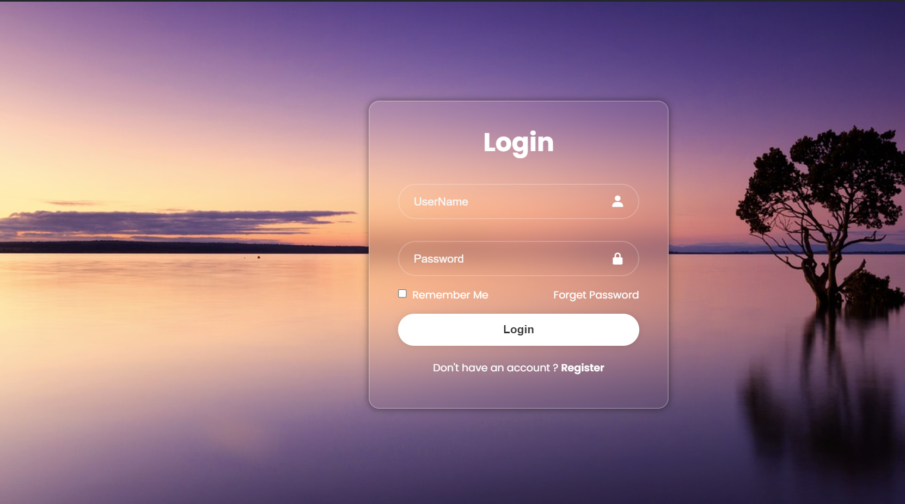

# loginform
a general login form
Certainly! Below is a sample README file for a login form project. Feel free to customize it according to your specific project details:

---

# Login Form Project

## Description

This project implements a simple login form using HTML, CSS, and JavaScript. Users can enter their credentials (username and password) to log in. If the credentials are valid, they are redirected to a dashboard page; otherwise, an error message is displayed.

## Features

- **Login Page:**
  - Input fields for username and password

## Installation

1. Clone this repository to your local machine.
2. Open `index.html` in your web browser.

## Usage

1. Open the login page (`index.html`).
2. Enter valid credentials (e.g., username: `user123`, password: `password123`).
3. Click the "Login" button.
4. If the credentials are correct, you'll be redirected to the dashboard page (`dashboard.html`).

## Screenshots

## Contributing

Contributions are welcome! If you find any issues or have suggestions for improvements, feel free to create a pull request.

Feel free to enhance this README with additional sections or customize it further based on your project's requirements. Good luck with your login form project! 😊🚀
